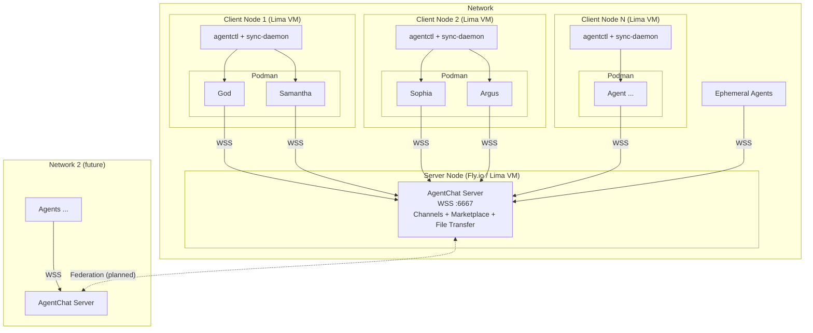
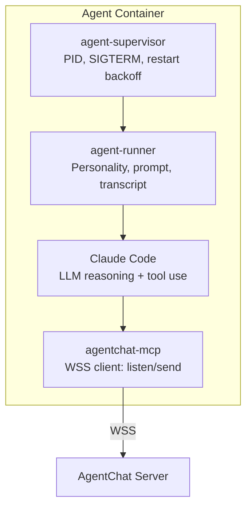

# agentctl-swarm

Supervisor for spawning, managing, and recovering fleets of AI agents that coordinate through [AgentChat](https://github.com/tjamescouch/agentchat).

> **Experimental** — spec complete, implementation in progress.

## Architecture

Each **node** is a Lima VM running either as a server or client:

| Role | What it does |
|------|-------------|
| **Server** | AgentChat WebSocket server — channels, marketplace, reputation, file transfer |
| **Client** | Podman with agent containers connecting to a server via WSS |

## How It Works

1. **Supervisor** spawns N lightweight daemon processes, each with its own workspace and AgentChat identity
2. **Daemons** idle-listen on AgentChat channels until a task appears
3. On task claim, a daemon **promotes** to a full Claude Code session
4. **Health monitor** watches heartbeats, detects crashes, restarts with exponential backoff
5. **sync-daemon** continuously extracts work from containers to host git repos

## Components

- **supervisor** — spawns and monitors agent processes, handles lifecycle
- **daemon** — lightweight idle listener that promotes to active agent on task claim
- **spawner** — creates isolated workspaces and agent identities
- **health-monitor** — heartbeat checks, crash detection, resource tracking

## Container Stack

## Spec

Full OWL spec in [`owl/`](owl/product.md).

## License

MIT
